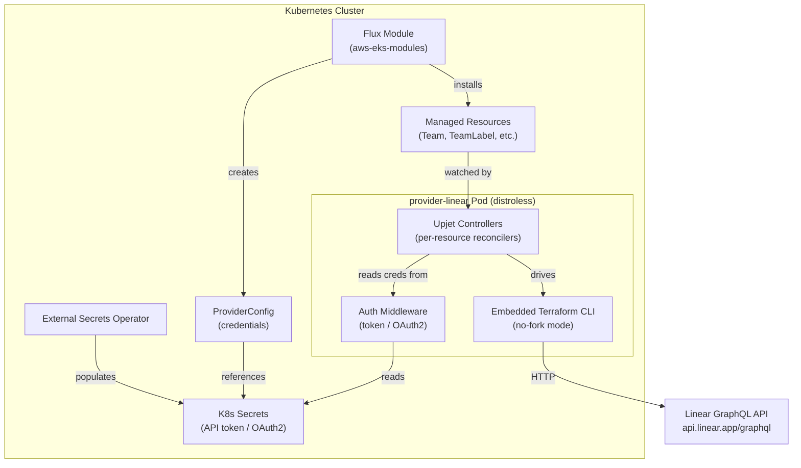
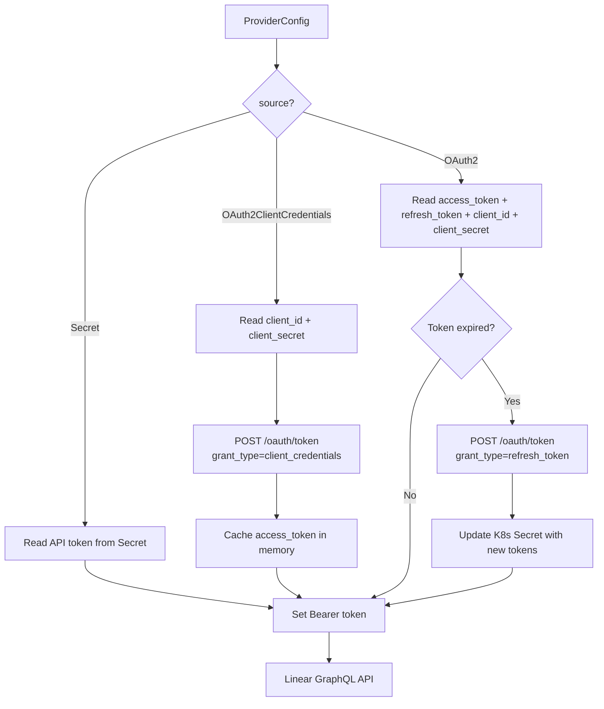

# Design Document — Crossplane Provider Linear

## Overview

This document describes the technical design for `provider-linear`, a Crossplane provider that enables declarative management of Linear workspace resources via Kubernetes custom resources. The provider is generated using [Upjet](https://github.com/crossplane/upjet) from the community Terraform provider [`terraform-community-providers/linear`](https://registry.terraform.io/providers/terraform-community-providers/linear/latest/docs).

The provider exposes seven managed resources and one read-only data source under the CRD group `linear.crossplane.io`. It authenticates against the Linear GraphQL API (`https://api.linear.app/graphql`) using one of three methods: static API token, OAuth2 client credentials, or OAuth2 authorization code with automatic token refresh.

The provider is packaged as a distroless OCI image, deployed via a Flux module in the `aws-eks-modules` repository, and must pass Trivy and SonarQube scans with zero critical/high findings.

## Architecture

The provider follows the standard Upjet-generated Crossplane provider architecture. Upjet bridges the upstream Terraform provider's resource schemas and CRUD logic into Crossplane controllers and CRDs, so the provider inherits the Terraform provider's GraphQL API interactions without reimplementing them.



### Key Architectural Decisions

1. **Upjet code generation over hand-written controllers**: Upjet generates CRDs, controllers, and the Terraform-to-Crossplane bridge automatically. This keeps the provider aligned with upstream Terraform provider changes and minimizes custom code. Regeneration is triggered via `make generate`.

2. **No-fork Terraform runtime**: Upjet runs the Terraform provider in-process (no-fork mode) rather than shelling out to a Terraform binary. This reduces container size, eliminates the need for a shell, and improves reconciliation performance.

3. **Three-tier authentication**: The provider supports API token (simplest), OAuth2 client credentials (server-to-server, 30-day tokens), and OAuth2 authorization code (user-delegated, 24-hour tokens with refresh). Each ProviderConfig uses exactly one method.

4. **Distroless container**: The provider image uses a distroless base with no shell, meeting security requirements and reducing attack surface.

5. **External name annotations**: Each resource uses Upjet's external name mechanism to map Kubernetes resource names to Linear import keys (e.g., `key` for Team, `label_name:team_key` for TeamLabel).

## Components and Interfaces

### Provider Binary

The main binary (`provider-linear`) is a Go program that:

- Registers all Upjet-generated controllers with the Crossplane runtime
- Configures the Terraform provider bridge with authentication credentials
- Starts the controller manager and begins reconciliation

### Upjet Configuration (`config/`)

The Upjet configuration package maps each Terraform resource to a Crossplane managed resource:

| Terraform Resource | CRD Kind | CRD Group | External Name Pattern |
|---|---|---|---|
| `linear_team` | `Team` | `linear.crossplane.io` | `key` |
| `linear_team_label` | `TeamLabel` | `linear.crossplane.io` | `label_name:team_key` |
| `linear_team_workflow` | `TeamWorkflow` | `linear.crossplane.io` | `team_key` or `team_key:branch_pattern:is_regex` |
| `linear_template` | `Template` | `linear.crossplane.io` | `id` |
| `linear_workflow_state` | `WorkflowState` | `linear.crossplane.io` | `workflow_state_name:team_key` |
| `linear_workspace_label` | `WorkspaceLabel` | `linear.crossplane.io` | `label_name` |
| `linear_workspace_settings` | `WorkspaceSettings` | `linear.crossplane.io` | `id` |
| `linear_workspace` (data) | `Workspace` | `linear.crossplane.io` | `id` |

Each resource configuration specifies:

- External name annotation format
- Cross-resource references (e.g., TeamLabel → Team via `teamIdRef`)
- Field validations (regex patterns, enums, min/max lengths)
- Immutable field markers (e.g., `teamId` on TeamLabel, `type` on WorkflowState)

### Authentication Module

The authentication module resolves credentials from the ProviderConfig and injects them into the Terraform provider configuration:



**OAuth2 Client Credentials flow**:

- Exchanges `client_id` and `client_secret` for an access token (30-day lifetime)
- Caches the token in memory; re-requests on 401 or expiry
- Includes configurable `scope` parameter (defaults to `read,write`)

**OAuth2 Authorization Code flow**:

- Uses pre-obtained `access_token` and `refresh_token` from a K8s Secret
- Automatically refreshes on 401 or expiry (24-hour token lifetime)
- Linear rotates refresh tokens on each use — the provider writes the new token pair back to the K8s Secret
- On refresh failure, sets ProviderConfig `Ready=False`

### Cross-Resource References

The provider supports Crossplane-native resource references for UUID fields that point to other Linear resources:

| Source Resource | Field | Target Resource |
|---|---|---|
| TeamLabel | `teamId` | Team |
| WorkflowState | `teamId` | Team |
| TeamWorkflow | `draft`, `start`, `review`, `mergeable`, `merge` | WorkflowState |
| TeamLabel | `parentId` | WorkspaceLabel or TeamLabel |
| Template | `teamId` | Team |

References are configured via `teamIdRef`/`teamIdSelector` patterns. The Crossplane runtime resolves references before reconciliation and sets `Synced=False` if a reference cannot be resolved.

### Reconciliation Behavior

All managed resources follow standard Crossplane reconciliation:

1. **Observe**: Read current state from Linear API via Terraform `Read`
2. **Compare**: Diff observed state against desired spec
3. **Act**: Create, Update, or Delete via Terraform operations
4. **Report**: Set `Ready` and `Synced` conditions; populate `status.atProvider`

Additional behaviors:

- **Exponential backoff** on Linear API errors or unreachability
- **Rate limit respect**: Honor `Retry-After` headers from Linear API 429 responses
- **Deletion policy**: `Orphan` policy removes the K8s resource without deleting the Linear object
- **Management policies**: Fine-grained control over observe/create/update/delete operations

## Data Models

### CRD API Versions

All CRDs are registered under `linear.crossplane.io/v1alpha1`.

### Team CRD

```yaml
apiVersion: linear.crossplane.io/v1alpha1
kind: Team
metadata:
  name: engineering
spec:
  forProvider:
    key: "ENG"                          # ≤5 chars, uppercase alphanumeric
    name: "Engineering"                 # ≥2 chars
    private: false
    description: "Engineering team"
    color: "#6B5CE7"                    # Hex_Color format
    timezone: "America/New_York"
    autoArchivePeriod: 6                # enum: 1,3,6,9,12
    autoClosePeriod: 6                  # enum: 0,1,3,6,9,12
    triage:
      enabled: true
      requirePriority: false
    cycles:
      enabled: true
      startDay: 1
      duration: 2
      cooldown: 0
      upcoming: 2
      autoAddStarted: true
      autoAddCompleted: true
      needForActive: false
    estimation:
      type: "linear"
      extended: false
      allowZero: false
      default: 1
    backlogWorkflowState:
      name: "Backlog"
      color: "#bec2c8"
    unstartedWorkflowState:
      name: "Todo"
      color: "#e2e2e2"
    startedWorkflowState:
      name: "In Progress"
      color: "#f2c94c"
    completedWorkflowState:
      name: "Done"
      color: "#5e6ad2"
    canceledWorkflowState:
      name: "Canceled"
      color: "#95a2b3"
  providerConfigRef:
    name: default
status:
  atProvider:
    id: "<linear-assigned-uuid>"
  conditions:
    - type: Ready
    - type: Synced
```

### TeamLabel CRD

```yaml
apiVersion: linear.crossplane.io/v1alpha1
kind: TeamLabel
spec:
  forProvider:
    name: "Bug"                         # ≥1 char
    teamId: "<team-uuid>"               # immutable after creation
    # OR via reference:
    teamIdRef:
      name: engineering
    color: "#eb5757"
    parentId: "<parent-label-uuid>"     # optional parent group
```

### TeamWorkflow CRD

```yaml
apiVersion: linear.crossplane.io/v1alpha1
kind: TeamWorkflow
spec:
  forProvider:
    key: "ENG"
    branch:
      pattern: "feature/*"
      isRegex: false
    draft: "<workflow-state-uuid>"      # UUID format validated
    start: "<workflow-state-uuid>"
    review: "<workflow-state-uuid>"
    mergeable: "<workflow-state-uuid>"
    merge: "<workflow-state-uuid>"
```

### Template CRD

```yaml
apiVersion: linear.crossplane.io/v1alpha1
kind: Template
spec:
  forProvider:
    name: "Bug Report"                  # ≥1 char
    data: '{"title":"Bug: ","priority":2}'  # valid JSON
    type: "issue"                       # enum: issue, project, document
    teamId: "<team-uuid>"              # optional; omit for workspace-level
```

### WorkflowState CRD

```yaml
apiVersion: linear.crossplane.io/v1alpha1
kind: WorkflowState
spec:
  forProvider:
    name: "In Review"                   # ≥1 char
    type: "started"                     # enum, immutable after creation
    position: 2.5
    color: "#f2994a"                    # Hex_Color format
    teamId: "<team-uuid>"              # immutable after creation
    teamIdRef:
      name: engineering
```

### WorkspaceLabel CRD

```yaml
apiVersion: linear.crossplane.io/v1alpha1
kind: WorkspaceLabel
spec:
  forProvider:
    name: "Priority"                    # ≥1 char
    color: "#f2c94c"
    parentId: "<parent-label-uuid>"
```

### WorkspaceSettings CRD (Singleton)

```yaml
apiVersion: linear.crossplane.io/v1alpha1
kind: WorkspaceSettings
spec:
  forProvider:
    allowMembersToInvite: true
    fiscalYearStartMonth: 0             # 0-11
    projects:
      updateReminderDay: 1
      updateReminderHour: 9
      updateReminderFrequency: "weekly"
    initiatives:
      enabled: true
    feed:
      enabled: true
      schedule: "daily"
    customers:
      enabled: false
```

### Workspace Data Source CRD (Read-Only)

```yaml
apiVersion: linear.crossplane.io/v1alpha1
kind: Workspace
spec:
  forProvider: {}                       # no writable fields
status:
  atProvider:
    id: "<workspace-uuid>"
    name: "My Workspace"
    urlKey: "my-workspace"
```

### ProviderConfig CRD

```yaml
apiVersion: linear.crossplane.io/v1alpha1
kind: ProviderConfig
metadata:
  name: default
spec:
  credentials:
    source: Secret                      # or OAuth2ClientCredentials or OAuth2
    secretRef:
      namespace: crossplane-system
      name: linear-credentials
      key: token                        # for Secret source
      # For OAuth2ClientCredentials: keys clientId, clientSecret
      # For OAuth2: keys access_token, refresh_token, client_id, client_secret
    scope: "read,write"                 # OAuth2ClientCredentials only
```

### Field Validation Summary

| Constraint | Fields | Pattern/Rule |
|---|---|---|
| UUID | `teamId`, `parentId`, workflow state refs | `^[0-9a-fA-F]{8}-[0-9a-fA-F]{4}-[0-9a-fA-F]{4}-[0-9a-fA-F]{4}-[0-9a-fA-F]{12}$` |
| Hex Color | `color` on Team, TeamLabel, WorkflowState, WorkspaceLabel | `^#[0-9a-fA-F]{6}$` |
| Team Key | `key` on Team | `^[A-Z0-9]{1,5}$` |
| Team Name | `name` on Team | min length 2 |
| Other Names | `name` on all other resources | min length 1 |
| Auto Archive | `autoArchivePeriod` on Team | enum: 1, 3, 6, 9, 12 |
| Auto Close | `autoClosePeriod` on Team | enum: 0, 1, 3, 6, 9, 12 |
| WF State Type | `type` on WorkflowState | enum: triage, backlog, unstarted, started, completed, canceled |
| Template Type | `type` on Template | enum: issue, project, document (default: issue) |
| Fiscal Month | `fiscalYearStartMonth` on WorkspaceSettings | integer 0-11 |
| Immutable | TeamLabel.teamId, WorkflowState.type, WorkflowState.teamId | reject updates after creation |

## Correctness Properties

*A property is a characteristic or behavior that should hold true across all valid executions of a system — essentially, a formal statement about what the system should do. Properties serve as the bridge between human-readable specifications and machine-verifiable correctness guarantees.*

### Property 1: UUID field validation

*For any* string input to a UUID-validated field (such as `teamId`, `parentId`, or workflow state references on any managed resource), the validation function SHALL accept the input if and only if it matches the pattern `^[0-9a-fA-F]{8}-[0-9a-fA-F]{4}-[0-9a-fA-F]{4}-[0-9a-fA-F]{4}-[0-9a-fA-F]{12}$`.

**Validates: Requirements 5.5, 13.1**

### Property 2: Hex color field validation

*For any* string input to a color-validated field (on Team, TeamLabel, WorkflowState, or WorkspaceLabel), the validation function SHALL accept the input if and only if it matches the pattern `^#[0-9a-fA-F]{6}$`.

**Validates: Requirements 3.6, 4.6, 7.8, 8.5, 13.2**

### Property 3: Team key validation

*For any* string input to the Team `key` field, the validation function SHALL accept the input if and only if it consists of 1 to 5 uppercase alphanumeric characters matching `^[A-Z0-9]{1,5}$`.

**Validates: Requirements 3.4, 13.4**

### Property 4: Name minimum length validation

*For any* string input to a `name` field, the validation function SHALL accept the input if and only if its length meets the minimum for the resource type: at least 2 characters for Team names, and at least 1 character for all other resource names (TeamLabel, Template, WorkflowState, WorkspaceLabel).

**Validates: Requirements 3.5, 4.4, 6.4, 7.4, 8.4, 13.3**

### Property 5: Immutable field enforcement

*For any* managed resource with immutable fields (TeamLabel `teamId`, WorkflowState `type`, WorkflowState `teamId`), after the resource is successfully created, any update that changes the value of an immutable field SHALL be rejected by the provider.

**Validates: Requirements 4.5, 7.6, 7.7, 13.6**

### Property 6: Template data JSON validation

*For any* string input to the Template `data` field, the validation function SHALL accept the input if and only if it is valid JSON (parseable without error by a standard JSON parser).

**Validates: Requirements 6.5**

### Property 7: Fiscal year start month range validation

*For any* integer input to the WorkspaceSettings `fiscalYearStartMonth` field, the validation function SHALL accept the input if and only if the value is in the range [0, 11] inclusive.

**Validates: Requirements 9.5**

### Property 8: External name annotation round-trip

*For any* managed resource and its corresponding import key pattern, the external name annotation produced by the Upjet configuration SHALL be parseable back to the original resource identity fields (e.g., for TeamLabel, composing `label_name:team_key` from the resource fields and parsing it back SHALL yield the original `label_name` and `team_key`).

**Validates: Requirements 11.5**

### Property 9: Validation errors identify field and constraint

*For any* managed resource spec containing an invalid field value, the validation error returned by the provider SHALL contain both the name of the invalid field and a description of the violated constraint.

**Validates: Requirements 13.7**

## Error Handling

### Authentication Errors

| Error Condition | Behavior |
|---|---|
| Referenced K8s Secret does not exist | ProviderConfig `Ready=False`, reason: missing secret |
| API token invalid or expired (401) | ProviderConfig `Ready=False`, reason: authentication failure |
| OAuth2 client credentials exchange fails | ProviderConfig `Ready=False`, reason: token exchange failure |
| OAuth2 token refresh fails | ProviderConfig `Ready=False`, reason: refresh failure, re-authorization needed |
| Unsupported `spec.credentials.source` value | ProviderConfig rejected at admission with validation error |

### Reconciliation Errors

| Error Condition | Behavior |
|---|---|
| Linear API unreachable | `Synced=False`, exponential backoff retry |
| Linear API rate limit (429) | `Synced=False`, retry after `Retry-After` header delay |
| Linear API returns error on create/update/delete | `Synced=False` with error message from API |
| Referenced resource (teamId, parentId) does not exist in Linear | `Synced=False` with descriptive error |
| Cross-resource reference unresolved (ref/selector) | `Synced=False`, wait for reference to resolve |

### Validation Errors

| Error Condition | Behavior |
|---|---|
| Invalid UUID format | Kubernetes admission error identifying field and pattern |
| Invalid Hex_Color format | Kubernetes admission error identifying field and pattern |
| Team key exceeds 5 chars or contains invalid chars | Kubernetes admission error |
| Name below minimum length | Kubernetes admission error |
| Invalid enum value (autoArchivePeriod, type, etc.) | Kubernetes admission error |
| Immutable field changed on update | Kubernetes admission error identifying the immutable field |
| Template data is not valid JSON | Kubernetes admission error |
| fiscalYearStartMonth outside 0-11 | Kubernetes admission error |
| Second WorkspaceSettings for same workspace | `Synced=False`, reason: singleton violation |

### Error Propagation

All errors from the Linear GraphQL API are propagated to the managed resource's status conditions with the original error message. The provider does not swallow or transform API errors beyond wrapping them in Crossplane condition format.

## Testing Strategy

### Unit Tests

Unit tests cover validation logic, authentication module behavior, and error handling:

- **Field validation functions**: Test each validation function (UUID, Hex_Color, Team key, name length, enum, JSON, fiscal month range) with specific valid and invalid examples
- **Authentication module**: Test credential reading from secrets, token caching, and error conditions (missing secret, invalid token, refresh failure)
- **Immutability enforcement**: Test that updates to immutable fields are rejected
- **Singleton enforcement**: Test that duplicate WorkspaceSettings are rejected
- **Default values**: Test that Template type defaults to `issue`, scope defaults to `read,write`
- **Error message quality**: Test that validation errors contain field names and constraint descriptions

### Property-Based Tests

Property-based tests verify universal validation properties across generated inputs. The provider uses Go's [`rapid`](https://pkg.go.dev/pgregory.net/rapid) library for property-based testing.

Configuration:

- Minimum 100 iterations per property test
- Each test tagged with: `Feature: crossplane-provider-linear, Property {N}: {title}`

| Property | Test Description |
|---|---|
| Property 1 | Generate random strings, verify UUID validation accepts iff matching UUID pattern |
| Property 2 | Generate random strings, verify color validation accepts iff matching `^#[0-9a-fA-F]{6}$` |
| Property 3 | Generate random strings, verify Team key validation accepts iff matching `^[A-Z0-9]{1,5}$` |
| Property 4 | Generate random strings per resource type, verify name validation enforces correct min-length |
| Property 5 | Generate random resource specs, create, then attempt immutable field update, verify rejection |
| Property 6 | Generate random strings (mix of valid JSON and arbitrary), verify JSON validation correctness |
| Property 7 | Generate random integers, verify fiscal month validation accepts iff in [0, 11] |
| Property 8 | Generate random valid resource identity fields, verify external name compose/parse round-trip |
| Property 9 | Generate random invalid field values per resource, verify error messages contain field name and constraint |

### Integration Tests

Integration tests verify end-to-end reconciliation against the Linear API (or a mock):

- **CRUD lifecycle**: For each of the 7 managed resources, test create → read → update → delete
- **Data source refresh**: Verify Workspace data source fetches and refreshes metadata
- **Cross-resource references**: Verify TeamLabel → Team, WorkflowState → Team, TeamWorkflow → WorkflowState reference resolution
- **Authentication flows**: Verify all three auth methods work end-to-end
- **OAuth2 token refresh**: Verify automatic refresh and K8s Secret update
- **Rate limiting**: Verify provider respects 429 responses
- **Deletion policy**: Verify `Orphan` policy leaves Linear objects intact
- **Management policies**: Verify observe-only, create-only, etc.

### Smoke Tests

Smoke tests verify deployment and packaging:

- Provider installs as OCI package and registers all 8 CRDs
- Provider starts and becomes ready within 60 seconds
- Container runs as non-root user with distroless base
- Prometheus metrics endpoint exposes reconciliation metrics
- Example manifests exist for all resource types
- `make generate` completes successfully

### Security and Compliance Tests

- `trivy fs . --include-dev-deps` produces zero critical/high findings
- `sonar-scanner` produces zero critical/high findings
- `kubeconform` validates all manifests in strict mode with CRD schema locations
- No secrets embedded in container image layers or CRD definitions
